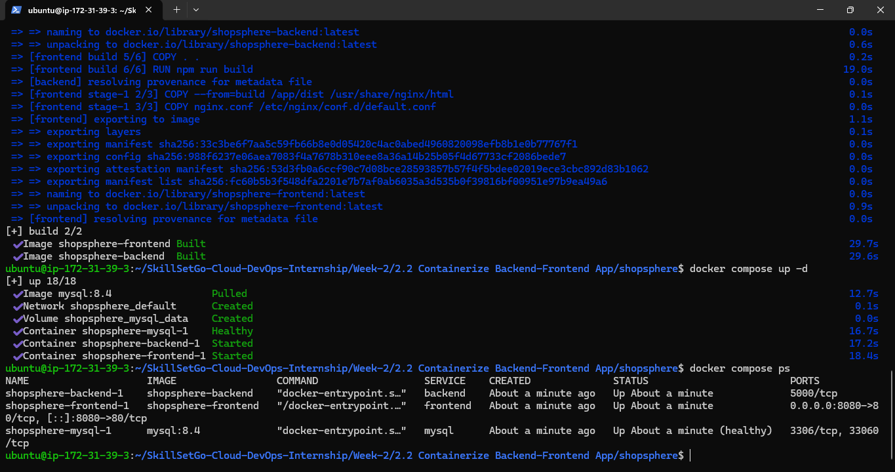
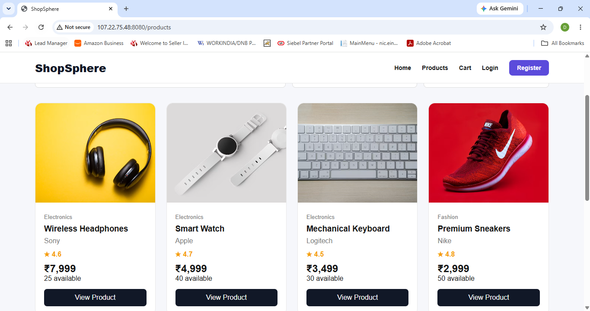
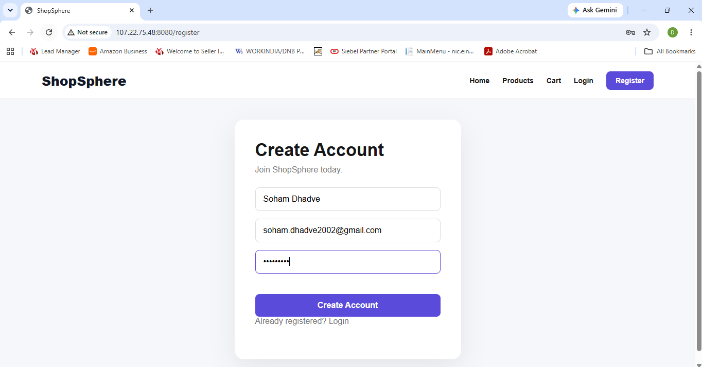
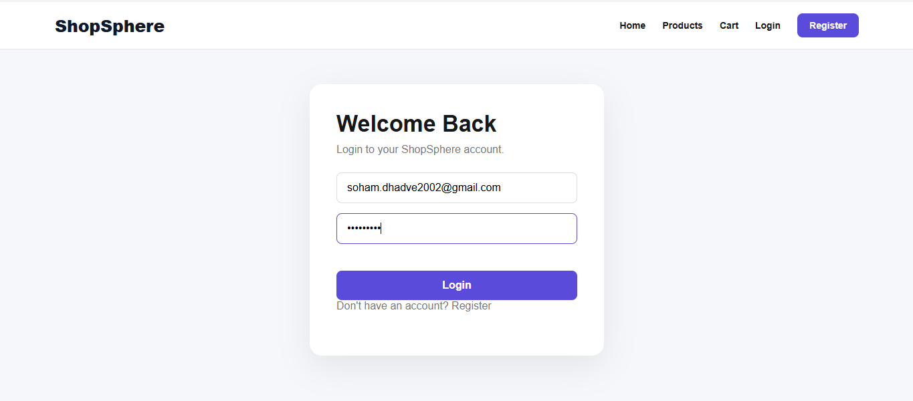
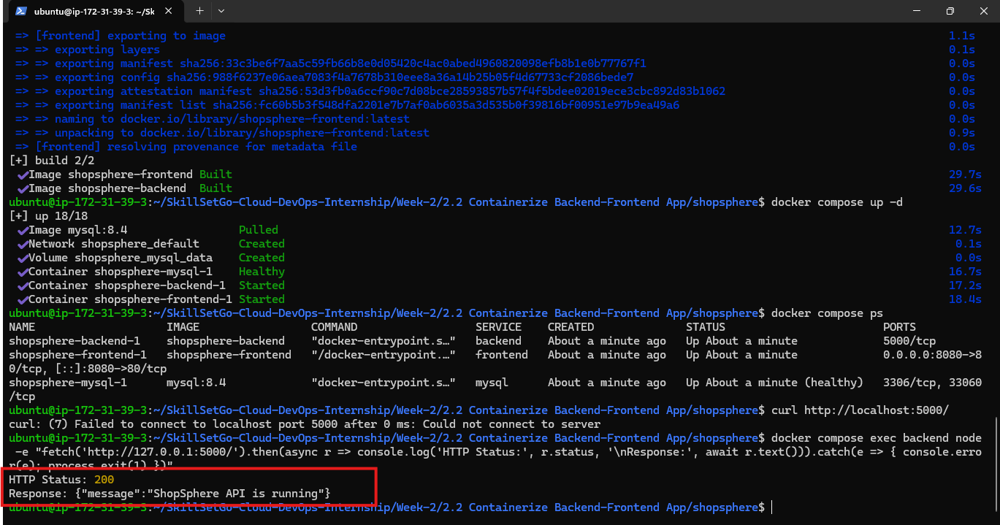

# Week 2.2 — Containerize Backend/Frontend App

## ShopSphere — Dockerized Full-Stack E-Commerce Application

### 1. Project Overview

ShopSphere is a full-stack e-commerce application containerized using Docker and Docker Compose. It includes a React frontend, a Node.js and Express backend API, and a MySQL database.

The application demonstrates how to package application components into separate containers and run them together using a multi-service Docker Compose configuration.

### 2. Objectives

- Containerize the React frontend using Docker.
- Containerize the Node.js backend using Docker.
- Configure MySQL as the application database.
- Use Docker Compose to manage multiple services.
- Configure internal communication between containers.
- Use Nginx to serve the frontend and proxy API requests.
- Store configuration and credentials in an environment file.
- Verify that the application runs on an AWS EC2 instance.

### 3. Technologies Used

- Frontend: React.js, Vite, HTML, CSS, JavaScript
- Backend: Node.js, Express.js
- Database: MySQL 8.4
- Containerization: Docker
- Multi-container orchestration: Docker Compose
- Web server and reverse proxy: Nginx
- Cloud platform: AWS EC2 (Ubuntu)
- Version control: Git and GitHub

### 4. Project Structure

```text
shopsphere/
├── backend/
│   ├── config/
│   ├── controllers/
│   ├── middleware/
│   ├── routes/
│   ├── Dockerfile
│   ├── .dockerignore
│   ├── package.json
│   └── server.js
├── frontend/
│   ├── src/
│   ├── Dockerfile
│   ├── .dockerignore
│   ├── nginx.conf
│   ├── package.json
│   └── vite.config.js
├── database/
│   └── schema.sql
├── Structure/
│   └── Project-Structure.txt
├── Screenshots/
├── .env
├── compose.yaml
└── README.md
```

**Note:** The `.env` file contains local configuration and secrets. It must not be committed to GitHub. The structure above describes the deployment directory; only include `.env` in your local structure if it exists there.

### 5. Application Architecture

The application runs using three Docker Compose services:

1. **Frontend:** Nginx serves the production React build on port 80 inside the container. Port 8080 on the EC2 host maps to this port.
2. **Backend:** Node.js and Express provide the application API on port 5000 inside the Docker network.
3. **Database:** MySQL stores application data and uses a persistent Docker volume.

The frontend sends API requests to `/api`. Nginx forwards these requests to the backend service using Docker's internal service networking.

```text
                 User's Browser
                        |
                        | HTTP :8080
                        v
              Frontend / Nginx
                  Container
                        |
              /api requests
                        |
                        v
              Backend / Express
                  Container
                        |
                        v
                MySQL Container
                        |
                        v
                Persistent Volume
```

### 6. Dockerfiles

#### Backend Dockerfile

The backend Dockerfile uses a Node.js Alpine image, installs production dependencies, copies the application files, and starts the Express server.

```dockerfile
FROM node:22-alpine

WORKDIR /app

ENV NODE_ENV=production

COPY package*.json ./

RUN npm ci --omit=dev

COPY . .

EXPOSE 5000

CMD ["npm", "start"]
```

#### Frontend Dockerfile

The frontend Dockerfile uses a multi-stage build. The first stage builds the React application with Vite. The second stage serves the generated static files using Nginx.

```dockerfile
FROM node:22-alpine AS build

WORKDIR /app

COPY package*.json ./

RUN npm ci

COPY . .

RUN npm run build

FROM nginx:alpine

COPY --from=build /app/dist /usr/share/nginx/html

COPY nginx.conf /etc/nginx/conf.d/default.conf

EXPOSE 80

CMD ["nginx", "-g", "daemon off;"]
```

### 7. Docker Compose Services

The `compose.yaml` file defines the following services:

- `frontend`: Builds the frontend image and publishes port 8080 on the EC2 host.
- `backend`: Builds the API image and communicates with MySQL and Nginx over the internal Docker network.
- `mysql`: Runs MySQL and stores data in the `mysql_data` volume.

The database initialization script is mounted into the MySQL container for initial database setup.

### 8. Environment Configuration

Create a `.env` file in the project root and configure the required database credentials and JWT secret.

Example variable names:

```env
MYSQL_ROOT_PASSWORD=*****
MYSQL_DATABASE=shopsphere
MYSQL_USER=shopsphere_user
MYSQL_PASSWORD=*******

DB_HOST=mysql
DB_USER=shopsphere_user
DB_PASSWORD=************
DB_NAME=shopsphere
PORT=5000

JWT_SECRET=********
```

Replace the example values with your own strong credentials. Never commit real passwords, JWT secrets, or production credentials to GitHub.

### 9. Deployment Steps

#### Step 1: Navigate to the project directory

```bash
cd ~/SkillSetGo-Cloud-DevOps-Internship/Week-2/"2.2 Containerize Backend-Frontend App"/shopsphere
```

#### Step 2: Validate the Compose configuration

```bash
docker compose config --quiet
```

#### Step 3: Build the Docker images

```bash
docker compose build
```

#### Step 4: Start the containers

```bash
docker compose up -d
```

#### Step 5: Verify container status

```bash
docker compose ps
```

#### Step 6: Check backend logs

```bash
docker compose logs --tail=100 backend
```

#### Step 7: Test the backend

```bash
docker compose exec backend node -e "fetch('http://127.0.0.1:5000/').then(async r => console.log(r.status, await r.text())).catch(console.error)"
```

Expected response:

```text
200 {"message":"ShopSphere API is running"}
```

#### Step 8: Test the frontend

```bash
curl -I http://localhost:8080/
```

Expected result: an HTTP `200 OK` response.

#### Step 9: Open the website

```text
http://107.22.75.48/:8080
```

Replace `107.22.75.48` with the public IPv4 address of your EC2 instance.

Configure the EC2 security group to allow TCP port 8080 from your IP address. Do not expose the backend port 5000 publicly.

### 10. Useful Docker Commands

Check running services:

```bash
docker compose ps
```

View all service logs:

```bash
docker compose logs
```

View backend logs:

```bash
docker compose logs -f backend
```

Restart the application:

```bash
docker compose restart
```

Stop the services:

```bash
docker compose down
```

Rebuild and restart after application changes:

```bash
docker compose up -d --build
```

**Note:** `docker compose down` stops and removes the containers and network, but normally preserves the named database volume. Do not use `docker compose down -v` unless you intentionally want to remove the volume and its stored database data.

### 11. Screenshots

Add screenshots to the `Screenshots/` directory and update the filenames below to match the actual images.

#### Screenshot 1 — Docker Containers

Shows the frontend, backend, and MySQL containers running.



#### Screenshot 2 — Frontend Website

Shows the ShopSphere website running in the browser.



#### Screenshot 3 — Registration Page

Shows the registration page of the ShopSphere application.



#### Screenshot 4 — Login Page

Shows the login page and successful login, if captured.



#### Screenshot 5 — Backend API Test

Shows the backend API returning its expected response.



### 12. Results

- Built separate Docker images for the frontend and backend.
- Deployed the frontend, backend, and MySQL as Docker Compose services.
- Configured Nginx to route API requests to the backend.
- Configured environment variables for database connectivity and JWT authentication.
- Verified the frontend and backend endpoints.
- Deployed the application on AWS EC2 using Docker Compose.

### 13. Learning Outcomes

This project provided practical experience with Dockerfiles, multi-stage builds, Docker Compose, container networking, environment variables, MySQL persistence, Nginx reverse proxy configuration, and application deployment on AWS EC2.

### 14. Author

**Name:** Soham Sanjay Dhadve

**Internship Program:** Skill Set Go EduTech Internship Program 2026

**Track:** Cloud & DevOps

**Task:** Week 2.2 — Containerize Backend/Frontend App

### 15. Conclusion

ShopSphere demonstrates how a full-stack web application can be packaged into separate containers and deployed together using Docker Compose. The project provides hands-on experience with application containerization and cloud deployment fundamentals.
